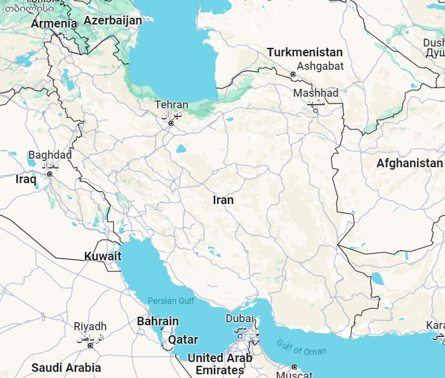
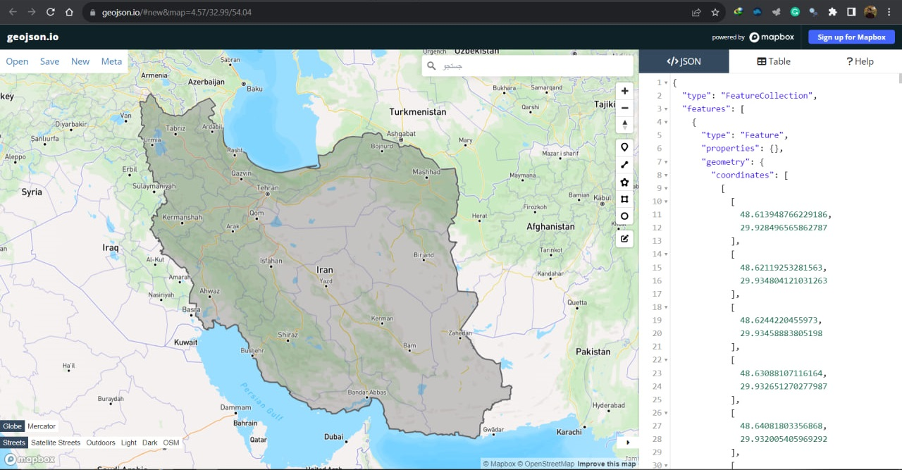
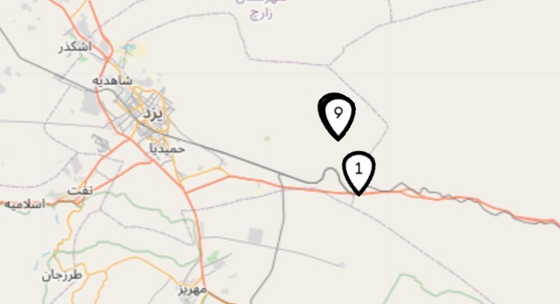
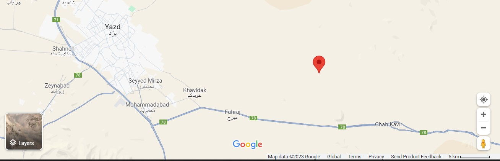

# Center of Iran Project

## Introduction
I had some friends from Yazd who claimed that **Yazd** is _exactly_ at the center of Iran. When asked how they could substantiate this claim, they retorted:

> "Well, if you don't agree, come and prove that Yazd isn't the center!"

Accepting the challenge, I set out to prove it's not true.

## What is the "center"?
Iran is not a regular polygon, which means finding its center is not as straightforward as one might think.

## Definition of Center
For the purpose of this project, the **center** is defined as:

> _The point at which the variance of the distances from the points on the border is the minimum possible - meaning it's less than the variance of distances from any other point within Iran to the points on the border._

## Data Collection
Coordinates of **3975 border points** were acquired using the [geojson website](https://geojson.io/#map=2/28.91/53.14 "GeoJSON website"), ensuring an equal distribution across the northeastern, northwestern, southwestern, and southeastern regions of Iran.

## Center-Finding Algorithm
The search was conducted over a substantial square-shaped region of Iran, encompassing the entirety of Yazd province. The coordinates of this area's boundaries are:

- **lng_min**: `49.781853529617024`
- **lng_max**: `58.37602322566812`
- **lat_min**: `29.235933551806966`
- **lat_max**: `35.393730146031245`

The algorithm commenced by dividing each edge of this square into five equal parts, forming a grid with a step size of 5. Proceeding from the resulting point, I expanded my search area by this step size in all four directions. Each subsequent phase decreased the step size by a tenth, refining the search until the step size was minuscule.

## Final Result
The algorithm progressively located points of interest, with some overlap occurring.

### The computed center of Iran is at:
- **Center Latitude**: `31.831892051806985`
- **Center Longitude**: `54.73842941961702`

### Here's [how it looks](https://www.google.com/maps/place/31%C2%B049'54.8%22N+54%C2%B044'18.4%22E/@31.9097537,54.3585796,10.64z/data=!4m4!3m3!8m2!3d31.8318889!4d54.7384444?entry=ttu "center of Iran on Google Maps") on Google Maps:

Contrary to the popular belief held by many people in Yazd, the geographical center of Iran is, in fact, kilometers away from the city.

---

Feel free to explore the code and contribute to the accuracy of this project!
Particularly, I believe there could be much better methods for collecting the coordinates of points on Iran’s border. If you have an idea for automating this process, please do not hesitate to have a go!
